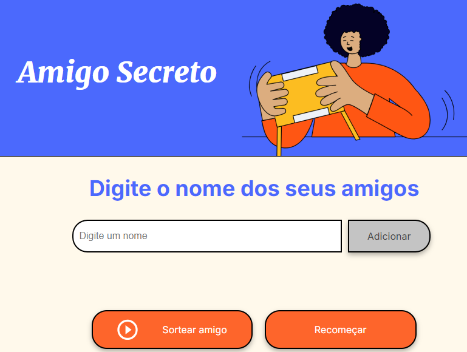

# 🎁 Amigo Secreto

Este é um aplicativo web simples para realizar sorteios de amigo secreto. Ele permite que você adicione nomes de amigos à lista e, em seguida, sorteie um amigo secreto aleatoriamente.

Você pode acessar o projeto através do seguinte link: [https://amigo-secreto-renanjsilv.netlify.app](https://amigo-secreto-renanjsilv.netlify.app)

## ✨ Funcionalidades

-   ➕ Adicionar nomes de amigos à lista.
-   🎲 Sortear um amigo secreto aleatoriamente.
-   🔄 Recomeçar o sorteio, limpando a lista e o resultado.

## 🕹️ Como usar

1.  Abra o `index.html` em seu navegador.
2.  Digite o nome de um amigo no campo de texto e clique em "Adicionar".
3.  Repita o passo 2 para todos os amigos que participarão do sorteio.
4.  Clique em "Sortear amigo" para realizar o sorteio.
5.  O nome do amigo secreto sorteado será exibido na tela.
6.  Clique em "Recomeçar" para limpar a lista e realizar um novo sorteio.

## 🗂️ Estrutura do projeto

-   `index.html`: Arquivo HTML principal que contém a estrutura da página.
-   `style.css`: Arquivo CSS que contém os estilos da página.
-   `app.js`: Arquivo JavaScript que contém a lógica da aplicação.
-   `assets/`: Pasta que contém as imagens utilizadas na aplicação.

## 💻 Tecnologias utilizadas

-   HTML
-   CSS
-   JavaScript

## 🚀 Como executar localmente

1.  Clone o repositório.
2.  Abra o arquivo `index.html` em seu navegador.

## 🤝 Contribuições

Contribuições são bem-vindas! Sinta-se à vontade para abrir issues e pull requests.

## 📜 Licença

Este projeto está sob a licença MIT.
